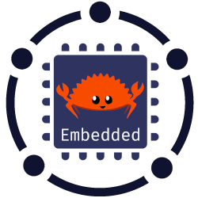

# Rust Embedded Community

The [rust-embedded-community][REC] GitHub organization serves two purposes: increasing the bus factor of hosted crates and provide a place for centralized maturation of experimental crates which are meant to be widely used.

For the official working group dedicated to [Rust] on embedded devices, please refer to the [Rust Embedded Working Group][REWG].

## Detailed mission

### Home for projects in need of further maintenance

There are libraries that were once developed but the original author does not have the time necessary for further development or has moved on to other projects.

The REC provides a place for those of these libraries which are accepted to live on, offering the opportunity for development to be easily aided by or taken over by a group of interested people, also to increase the "bus factor".

### Centralized maturation of experimental crates

The REC provides a place for crates to mature in a centralized way. That means a centralized organization where several people can collaborate in projects that are (still) too experimental but are meant to be widely-used.

The shared ownership provided by this organization ensures that widely-used crates do not become unmaintained.

### Relation to the Rust Embedded Working Group organization

The [Rust Embedded Working Group][REWG] is an official working group of the [Rust programming language][rust]. This organization is not. This organization should be seen as separate and "non-blessed".

Sometimes, crates from this organization may be migrated to the [REWG] or integrated into [REWG] crates. However, that remains a process regulated by the [REWG] itself.

## The original idea

Several members of the Rust Embedded Working Group got together at Oxidize 2019 and wondered, "what can we do with these half-finished projects we've started but never quite find the time to finish"? Rather than invite each other to all our repositories, we wondered if there could be a place where unloved crates could move in and get some of the care and attention they deserve. And so, the rust-embedded-community was born.

## Joining the community

We need maintainers! If you're interested in updating some of the projects we care for, open an issue on this `meta` repo, or submit a PR on this README adding yourself to the Maintainers section.

## Adding a project

We haven't really worked out any rules as to what we will and won't look after, but at the moment it's fair to say a project needs to be:

* Written in the [Rust Programming Language][rust]
* Target resource constrained devices (be they small Linux devices, RTOS based or bare-metal)
* Useful to the wider Rust Embedded community (or at least, not just the author)
* Licensed under an [OSI]-approved open-source license.

If you'd like to suggest a project to be moved to the community, please open an issue and tell us about it.

## Crates.io

We're happy to be added as Owners on crates.io for projects we host. We can then help co-ordinate pushing out updates when something elsewhere in the ecosystem causes breakage. Open an issue if you want to discuss this.

Once approved, a maintainer can add the team by adding `github:rust-embedded-community:all`. Note that this can only be done by a member of the team, so you might first have to add one of them individually if you aren't one yourself.

## Maintainers

* Jonathan 'theJPster' Pallant - [GitHub](https://github.com/thejpster) | [Twitter](https://twitter.com/therealjpster) | [Keybase](https://keybase.io/thejpster)
* James Munns - [GitHub](https://github.com/jamesmunns)
* Vadim Kaushan - [Github](https://github.com/disasm)
* Diego Barrios Romero - [Github](https://github.com/eldruin)
* Mathias Koch - [Github](https://github.com/MathiasKoch)
* Ryan Summers - [GitHub](https://github.com/ryan-summers)
* Matt Dunlap - [GitHub](https://github.com/dunmatt)
* Jan Niehusmann - [Github](https://github.com/jannic)
* Scott Mabin - [Github](https://github.com/mabezdev)

[OSI]: https://en.wikipedia.org/wiki/Open_Source_Initiative
[REWG]: https://github.com/rust-embedded
[REC]: https://github.com/rust-embedded-community
[rust]: https://www.rust-lang.org
